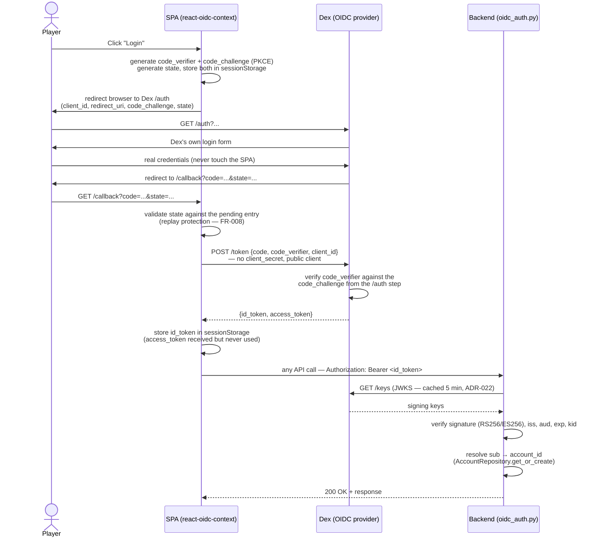

# ADR-034: OIDC frontend login — SPA-direct Authorization Code + PKCE, public Dex client, id_token as bearer credential

**Status**: Accepted | **Date**: 2026-07-07 | **Branch**: `008-oidc-frontend-login`

## Context

Spec 008 replaces the frontend's paste-a-token dev stub with a real browser-driven OIDC
login. The backend side of OIDC is already done (ADR-022, slice 004): `oidc_auth.py`
validates any `Authorization: Bearer <JWT>` against a JWKS endpoint, checking `iss`,
`aud` (default `gamebook`), `exp`, and `kid`. It has no session/cookie infrastructure and
no `/callback` route — it only ever sees a bearer token.

Two architectures were on the table:

1. **SPA-direct**: the browser talks to Dex's `authorize` and `token` endpoints itself
   (Authorization Code + PKCE, RFC 7636), and hands the resulting token straight to the
   backend as a bearer credential.
2. **Backend-mediated (BFF)**: a new backend `/callback` route holds a confidential
   client secret and performs the code→token exchange server-side, then issues its own
   session to the SPA.

Dex's `docker/dex/config.yaml` already defines a *confidential* static client
(`id: gamebook`, `secret: gamebook-secret-dev`) with redirect URIs for both a frontend
origin (`localhost:3000/callback`) and a backend origin (`localhost:8000/callback`) —
suggestive of an undecided/never-finished BFF plan. Neither URI matches a real running
service today (Vite dev is `5173`, the compose frontend is `8080`, the backend is
`8000` but implements no `/callback`), and nothing in the codebase (tests, scripts,
`docker-compose.yml`) ever reads `gamebook-secret-dev` — the secret is unused dead
configuration.

FR-002 of spec 008 requires that no long-lived shared secret ever reach the browser or
appear in browser-visible network traffic.

## Decision

**SPA-direct Authorization Code + PKCE**, no backend mediation:

1. **Dex client**: convert the existing `gamebook` static client to a **public client**
   (`public: true`, no `secret`/`secretEnv` field — supported by Dex since PKCE landed in
   v2.26; this repo pins `v2.41.1`). `client_id` stays `gamebook`, so
   `OIDC_AUDIENCE=gamebook` in `docker-compose.yml` / backend env needs no change.
   `redirectURIs` are corrected to the origins that actually exist:
   `http://localhost:5173/callback` (Vite dev) and `http://localhost:8080/callback`
   (compose `gameobs` profile frontend).
2. **PKCE eliminates the secret requirement entirely** (not just "moves it server-side")
   — there is no secret to leak, satisfying FR-002 more directly than a BFF would.
3. **Client library**: `react-oidc-context` (thin React wrapper over `oidc-client-ts`).
   It implements Authorization Code + PKCE for public clients out of the box, manages the
   one-time-use `state`/`code_verifier` handoff (satisfies FR-008 — a replayed
   `/callback` URL fails because the matching transient state was already consumed), and
   supports `automaticSilentRenew` (Story 2 — session survives reload without repeating
   the manual flow). Its hook shape (`isAuthenticated`, `signinRedirect()`,
   `removeUser()`) maps closely onto the project's existing `useAuth()` seam
   (`frontend/src/hooks/useAuth.ts`), so only that hook, `AuthPage.tsx`, a new
   `/callback` route, and `main.tsx` (wrapping the app in `AuthProvider`) change — the
   rest of the SPA is untouched, same as the seam was designed for (see
   `frontend/src/api/client.ts`'s `setTokenProvider()`).
4. **Bearer credential sent to the backend is the OIDC `id_token`, not the
   `access_token`.** The backend validates `aud == OIDC_AUDIENCE` (the client_id) and
   `iss == OIDC_ISSUER` — this is exactly what the OIDC spec guarantees about the
   `id_token` (its `aud` MUST equal the client_id, and it MUST always be a signed JWT).
   The `access_token` format and claims are opaque per RFC 6749; relying on Dex's
   incidental JWT access-token shape would silently break under "any OIDC-compliant
   provider" (spec 008's own assumption). Sending the `id_token` keeps the backend
   provider-agnostic with zero changes to `oidc_auth.py`.
5. **Sign-out is local-only** (`removeUser()` clears the stored token; no
   `end_session_endpoint` redirect to Dex). Dex's RP-initiated logout support is
   inconsistent across versions/connectors and nothing in spec 008 requires killing the
   IdP-side session — only that the SPA stops sending a token.
6. **Token storage**: `sessionStorage` (`WebStorageStateStore({ store:
   window.sessionStorage })`), matching the storage the dev stub already used
   (`client.ts`'s `sessionStorage.getItem('auth_token')`) — same reload/tab-close
   semantics as what's already shipped, not a silent persistence upgrade.

### Complete flow (frontend PKCE + backend validation, end to end)

No secret appears anywhere in this diagram — the public client's proof of identity is
the `code_verifier` (only the browser that started the flow has it), and the backend's
proof of trust is Dex's public signing key (JWKS), not a shared secret.

Local-dev-only wrinkle (not part of the decision, just a fact about running this
against local Dex): Dex's configured `issuer` is the compose-network hostname
`dex:5556` — the value baked into every token's `iss` claim and used by the backend
(`OIDC_ISSUER`) — but the browser can only reach Dex at `localhost:5556`. The SPA
resolves this by hand-seeding the `/auth` and `/token` endpoint URLs at the
browser-reachable host instead of relying on `.well-known` discovery (which would
return the container-network URLs verbatim); `metadata.issuer` still matches what's
actually in the tokens. See `frontend/src/auth/oidcConfig.ts` and
`specs/008-oidc-frontend-login/research.md`'s "browser-unreachable issuer" addendum.
Any real (non-Dex, non-local) provider needs no such workaround — `issuer` and the
browser-reachable authority are simply the same URL.

### Alternatives considered

| Option | Rejected because |
|---|---|
| Backend-mediated code exchange (BFF), confidential client | Adds a `/callback` route, session storage, and a cookie/token hand-off the backend has no infrastructure for today; the secret it would protect isn't needed at all once PKCE is used. Matches nothing the codebase already built (the auth seam is bearer-JWT-only). |
| Hand-rolled PKCE (`crypto.subtle` + manual `state` bookkeeping) | Replay protection (FR-008) and code_verifier handling are exactly the kind of security-sensitive code a maintained library gets right; no reason to reimplement RFC 7636 by hand. |
| Send `access_token` to the backend | Not guaranteed to be a JWT or to carry `aud`/`iss` on other OIDC providers — violates the spec's own "must not hardcode Dex-specific behavior" assumption. |
| Second Dex client (`gamebook-spa`) alongside the existing confidential one | Unnecessary — nothing uses the confidential client's secret today; converting `gamebook` in place is simpler and avoids maintaining two client registrations. |

## Consequences

**Positive**:
- Zero backend code changes — `oidc_auth.py` (ADR-022) is reused exactly as-is.
- No secret ever exists in browser-reachable config or traffic (FR-002 by construction,
  not by discipline).
- Auth seam (ADR-011-era design) holds: swapping the dev stub for real OIDC touches only
  `useAuth.ts`, `AuthPage.tsx`, `main.tsx`, and a new `/callback` route.
- `react-oidc-context` handles token refresh, replay protection, and storage — less
  custom security code to review and maintain.

**Negative**:
- New frontend dependency (`react-oidc-context` + `oidc-client-ts`) — first non-React
  runtime dependency in `frontend/package.json`.
- `sessionStorage` means signing in in one tab doesn't carry to a new tab; acceptable
  because that's the behavior the dev stub already had (no regression).
- Sign-out doesn't end the Dex-side session — a player could technically get a fresh
  token via silent auth (SSO cookie at Dex) without re-entering credentials. Acceptable:
  spec 008 defines "signed out" as the SPA no longer holding a token, not as killing the
  IdP session.

## Related

- ADR-022 (OIDC JWT/JWKS validation — unchanged, consumed as-is)
- ADR-011 (auth seam established in slice 003)
- `specs/008-oidc-frontend-login/spec.md`, `research.md`
